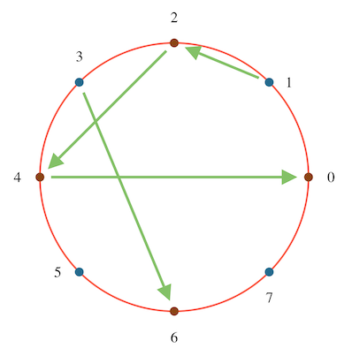
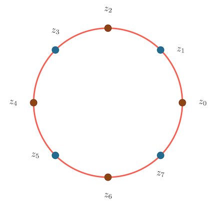

In math curricula, the [Fast Fourier Transform](https://en.wikipedia.org/wiki/Fast_Fourier_transform) is usually encountered in fairly advanced classes. For example, you might first come across it in a course on Real Analysis or Digital Signal Processing. My own undergraduate math courses started with Fourier series, then moved on to the (continuous) Fourier transform, then the discrete-time Fourier transform and discrete Fourier transform. The FFT is introduced as more of a corollary optimization. In engineering courses, it comes up all the time, but almost always as a tool to move between the time domain and frequency domain, to the point where the Fast Fourier Transform (which is an algorithm) becomes a synecdoche for the transform itself.

This is a shame, because the FFT does not use any advanced mathematics, requiring only an understanding of the algebra of complex numbers. Here I try to explain it in such a way. As we go, I will add some snippets of Python code, eventually building up to a complete implementation.

After writing this, I found that there is a pretty good overview at [3Blue1Brown]([But what is a convolution? - YouTube](https://youtu.be/KuXjwB4LzSA?t=123)), that largely follows along the same lines. I hope this fleshes out some of the detail that the video glosses over.

# Motivation: (Fast) Convolutions

Instead of starting with the Fourier Transform, let's start with a [related]([Convolution theorem - Wikipedia](https://en.wikipedia.org/wiki/Convolution_theorem)) transform: the discrete convolution (from now on, everything will be implicitly discrete). In fact, let's start at an even higher level: the digital filter.

Suppose you have recorded $$N$$ samples of audio at some frequency, call it $$A=A[0..N-1]$$. The audio quality might be absolutely pristine, but more likely it's been corrupted by glitches, noise, wind, pops and clicks from people bumping into the microphone, and so on. What can we do to clean up the signal? One common approach, at least for phenomena that are of short duration (such as pops and clicks) is to ***filter*** it. For example, we might replace each sample of the signal with the moving average of the $$5$$ values before and the $$5$$ values after it. Or we might want to use a more elaborate filter with a larger support, such as a Gaussian.

The way I think about this operation is that the filter slides along the signal. And at each stage, you perform a pointwise multiplication of the filter and the overlapping region of the signal, and sum up the values (mathematically this is just an inner product).


Mathematically, if you have a signal $$A[0..N]$$ and a kernel $$B[0..M]$$, for odd $$M$$ (so that the sum below is balanced), then the convolution is:

$$
(A *_{conv}B)[n] = \sum_{k=-M/2}^{M/2}{A[n-k]*B[k]}
$$

(Here follow the convention that if $$A[k]$$ is zero for $$k < 0$$ or
$$k \ge |A|$$.)

Another way to write this is to note that $$(n-k) + k = n$$, so:

$$
(A *_{conv}B)[n] = \sum_{k+j=n}{A[k]*B[j]}
$$

This formulation will be more useful for us later. The smoothing function is typically referred to as the ***filter*** or as the ***kernel***. This operation, of smoothing out one function by another, comes up all the time in math, signals analysis, and engineering, and is known as the convolution. To name but a few examples, it's used to implement antialiasing filters in audio and graphics, to compute spectrograms in signals analysis, for edge detection in image analysis. It is also the central operation in the convolutional neural network. It's definitely useful to be able to perform it quickly.

So, let's start with a method declaration:

```python
Signal = typing.NewType("Signal", numpy.ndarray)

def convolution(signal: Signal, filt: Signal) -> Signal:
    ...
```

# Convolutions and Polynomial Multiplication

### Convolutions are equivalent to polynomial multiplication

The thing is, everyone who has taken an Algebra II course has seen this operation before, just under a different name: ***polynomial multiplication***. Given two polynomials:

$$
a(x)=a_0+a_1x+a_2x^2+...+a_nx^n\\
b(x)=b_0+b_1x+b_2x^2+...+b_mx^m
$$

Their product is given by:

$$
\begin{align*}
(a*b)(x) & = (a_0b_0) \\
& + (a_0b_1 + a_1b_0)x \\
& + (a_0b_2 + a_1b_1 + a_2b_0)x^2 \\
& + ... \\
& + (a_nb_m)x^{n+m}
\end{align*}
$$

Note that this is exactly equivalent to computing the convolution of the sequences $$A=[a_0,a_1,...,a_n]$$ and $$B=[b_0,b_1,...,b_m]$$.

$$
A*_{conv}B[i] = (a*b)_i
$$

That is, the coefficient of $$x^i$$ in their product as polynomials is equal to the $$i^{th}$$ value of their convolution as sequences. So we can restate our problem: Given two polynomials $$a(x)$$ and $$b(x)$$, compute (the coefficients of) their product $$a(x)b(x)$$.

Let's quickly think through the runtime complexity of this problem. By directly computing the product, multiplying each pair of coefficients in the two multiplicands, we can compute the product in time $$O(nm)$$. But, as we will see, we can do better.

```python
# A list of coefficients
PolyCoeffs = typing.NewType("PolyCoeffs", list[float])

def product_naive(a: PolyCoeffs, b: PolyCoeffs) -> PolyCoeffs:
    result = [0 for _ in range(len(a) + len(b))]
    for ai, ac in enumerate(a):
        for bi, bc in enumerate(b):
            result[ai+bi] += ac * bc
    return PolyCoeffs(result)
```

### Representations of Polynomials

Why recast the convolution in this way? Because we can exploit our knowledge of polynomials, in particular, that polynomials can be represented in multiple ways. The usual way, as a list of coefficients, is one. Another common way is by a constant and its set of roots, as in $$f(x)=c(x-r_0)(x-r_1)...(x-r_n)$$.

And, relevant to our use case, you can represent an $$n^{th}$$ degree polynomial by its value on $$n+1$$ distinct points (you end up with a system of $$n+1$$ equations and $$n+1$$ variables). Just to work through an example, suppose that you have a second degree polynomial (a quadratic) $$f(x)=2x^2+x+7$$, and we choose to represent it by its values on $$\lbrace 0,1,2 \rbrace$$:

$$
\begin{align*}
& f(0)=7 \\
& f(1) = 10 \\
& f(2) = 17
\end{align*}
$$

Then we end up with the following system of equations:

$$
7 = f(0) = a_0 + a_1(0) + a_2(0)^2 = a_0 \\
10 = a_0 + a_1(1) + a_2(1)^2 = a_0+a_1+a_2 \\
11 = a_0 + a_1(2) + a_2(2)^2 = a_0 + 2a_1 + 4a_2
$$

Which we can solve in the usual way:

$$
\begin{align*}
& \mathbf{a_0 = 7} \\\\

& a_0 + a_1 + a_2 = 10 \\
& a_1 = 3-a_2 \\\\

& a_0 + 2a_1 + 4a_2 = 17 \\
& 7 + 2(3-a_2) + 4a_2 = 17 \\
& 7 + 6 + 2a_2 = 17 \\
& \mathbf{a_2 = 2} \\\\

& \mathbf{a_1 = 3 - a_2 = 1}

\end{align*}
$$

So, $$f(x) = 2x^2 + x^1 + 7x^0$$, as expected. This representation is known as the ***point-value representation***. From now, we will adopt the convention that lower-case letters refer to polynomials in their coefficient form, and upper-case letters refer to them in their point-value representations.

Here's a type for a list of values, and for moving back and forth between the representations:

```python
Values = typing.NewType("Values", list[complex])

class Representation(Protocol):
    def to_values(self, coeffs: PolyCoeffs) -> Values:
        ...

    def to_coeffs(self, values: Values) -> PolyCoeffs:
        ...
```

### Why use point-value representation?

The point-value representation is a natural choice for our problem, because multiplication in this domain is very fast, just being the pointwise product of the values. Note that if $$a(x)$$ has degree $$n$$ and $$b(x)$$ has degree $$m$$, their product $$a(x)*b(x)$$ will have degree $$(n+m)$$. So if you have evaluated $$a(x)$$ and $$b(x)$$ on a set of $$(n+m+1)$$ points, giving:

$$
A=[a(x_0),...,a(x_{n+m})]\\
B=[b(x_0),...,b(x_{n+m})]
$$

Then the representation of their product $$a(x)b(x)$$ is:

$$
A*B = [a(x_0)b(x_0),...,a(x_{n+m})b(x_{n+m})]
$$

This requires only $$(n+m)$$ multiplications to compute. Or in code:

```python
def product_values(a: Values, b: Values) -> Values:
    return Values([ai * bi for ai, bi in zip(a, b)])
```

We can start to see the shape of a fast algorithm for polynomial multiplication (and thus convolutions). Given two polynomials, $$a(x)$$ and $$b(x)$$:

$$
\begin{align*}
& 1.\ Pick \ (n+m+1)\ points,\ x_0,...,x_{n+m}\\
& 2.\ Compute \ A=[a(x_0),...,a(x_{n+m})]\\
& 3.\ Compute \ B=[b(x_0),...,b(x_{n+m})]\\
& 4.\ Pointwise\ multiply\ A*B=[a(x_0)b(x_0),...,a(x_{n+m})b(x_{n+m})]\\
& 5.\ Compute \ the \ coefficients\ of \ A*B
\end{align*}
$$

In code:

```python
def product_faster(
        a: PolyCoeffs,
        b: PolyCoeffs,
        rep: Representation
) -> PolyCoeffs:
    # Convert to values
    av = rep.to_values(a)
    bv = rep.to_values(b)
    # Multiply pointwise
    prod = product_values(av, bv)
    # Convert back
    return rep.to_coeffs(prod)
```

At first, it does not seem like we have made our situation any better. For example, by using [Horner's method]([Horner's method - Wikipedia](https://en.wikipedia.org/wiki/Horner%27s_method)), step $$(2)$$ would take $$O((n+m)^2)$$ time, no better than the naive method. We have not addressed step $$(5)$$ at all, and it is not obvious that we can perform steps $$(2)$$ and $$(3)$$ any faster than the naive multiplication algorithm.

### Computing point-value representations

Not obvious, but true. There is in fact a set of points on which you can evaluate a polynomial quickly. This is the only part of the algorithm that requires even moderately advanced mathematics. Instead of just telling you, it's worth thinking through how you might have thought it up.

Say you were approaching this problem for the first time. One thread to pull on is that evaluating polynomials has a recursive structure. Given a polynomial $$a(x)=a_0+a_1x^1+a_2x^2+...+a_nx^n$$ of degree $$n$$ (for now, say $$n$$ is odd), we can split it into "even" and "odd" parts:

$$
\begin{align*}
a(x) &= a_0+a_2x^2+a_4x^4+...+a_nx^n\\
& + a_1x+a_3x^3+a_5x^5+...+a_{n-1}x^{n-1}\\\\
a(x) &= (a_0+a_2x^2+a_4x^4+...+a_nx^n)\\
& + x(a_1+a_3x^2+a_5x^3+...+a_{n-1}x^{n-2})
\end{align*}
$$

These two parts look like polynomials in $$x^2$$, and indeed they are, of degree $${\lceil n/2 \rceil}$$:

$$
\begin{align*}
a_{even}(z) &= a_0+a_2z+a_4z^2+...+a_nz^{\lceil n/2 \rceil}\\
a_{odd}(z) &= a_1 + a_3z + a_5z^2 + ... + a_{n-1}z^{\lceil n/2 \rceil}\\
a(z) &= a_{even}(z^2)+za_{odd}(z^2)
\end{align*}
$$

If you've studied algorithms at all, this might start to look like dynamic programming. We've split the problem into recursive subproblems. Now can we figure out how to reuse our work from those subproblems? This brings us to the main insight that makes the Fast Fourier Transform possible (and why the variable switched from $$\mathbf{x}$$ to $$\mathbf{z}$$). There is a family of sets of points $$W_n$$, for which $$z^2 \in W_{n/2} \ for \ all \ z \in W_n$$, namely the $${n^{th}}$$***complex roots of unity***. If $$z$$ is an $$n^{th}$$ root of unity (say for even $$n$$), then we have, for some $$k$$:

$$
\begin{align*}
z &= e^{2\pi ik/n} \\
z^2 &= (e^{2\pi ik/n})^2 \\
    &= e^{(2\pi ik)/(n/2)}
\end{align*}
$$

And we see that $$z^2$$ is an $$(n/2)^{th}$$ complex root of unity. This can be a little tricky, so let's draw it out for a specific example. Below, you can see the $$8^{th}$$ roots of unity, labelled $$0$$ to $$7$$, so that the $$k^{th}$$ root is equal to $$e^{2\pi i k/8}$$. The $$4^{th}$$ roots of unity are colored brown. The green arrows show the result of squaring each root (to keep the image from being too cluttered, I've only shown the first half). And you can see that, indeed, the square of each $$8^{th}$$ root of unity is a $$4^{th}$$ root of unity.



Why is this a big deal? Because we can reuse the work from the smaller subproblems in our recursive formulation. Say that we have computed $$a_{even}(z)$$ and $$a_{odd}(z)$$ on the complex $$(n/2)^{th}$$ roots of unity, and stored them in arrays $$A_{even}[0..n/2]$$ and $$A_{odd}[0..n/2]$$.

Given a complex $$n^{th}$$ root of unity, $$z$$, as we discussed earlier, $$z^2$$ is an $$(n/2)^{th}$$ root of unity, and so we do not need to recompute $$a_{even}(z^2)$$ and $$a_{odd}(z^2)$$. We can just look them up in the arrays $$A_{even}$$ and $$A_{odd}$$. There is a lot of algebra here, which obscures what is actually a simple operation. I find pictures easier to understand.

Say $$n=8$$. Start with the $$n^{th}$$ roots of unity:



Recursively compute $$A_{even}$$ and $$A_{odd}$$ on the $$(n/2)^{th}$$ roots of unity (every other point).


To compute, say $$a(z_1)$$, we look up the values for $$a_{even}(z_2)$$ and $$a_{odd}(z_2)$$ (as $$z_1^2=z^2$$):


So the whole recursive algorithm is:

$$
\begin{align*}
&1.\ Split\ a(x)\ into\ a_{even}(x)\ and\ a_{odd}(x) \\
&2.\ Recursively\ compute\ a_{even}(x)\ and\ a_{odd}(x)\ on\ the\ (n/2)^{th}\ roots\ of\ unity \\
&3.\ For\ each\ n^{th}\ root\ of\ unity\ z_k:\\
& \ \ \ \ \ \ \ (a)\ Look\ up\ a_{odd}(z_k^2)\ and\ a_{even}(z_k^2) from\ the\ computation\ in\ (2)\\
& \ \ \ \ \ \ \ (b)\ Compute\ a(z_k)=a_{even}(z_k^2)+z_ka_{odd}(z_k^2)
\end{align*}
$$

Step $$(3)$$ just requires two lookups, a single complex multiplication and a single complex addition.

Perhaps surprisingly, there isn't much code. For now, let's assume that $$n=2^m-1$$ for some $$m$$, so that the recursion is nice and simple. It won't affect the asymptotic runtime, as you at most have to double the number of coefficients in the polynomial.

```python
class RootsOfUnityRepresentation(Representation):
    """A degree n polynomial is represented by its value on the n^th roots of unity"""

    def to_values(self, coeffs: PolyCoeffs) -> Values:
        n = len(coeffs)
        if n == 1:
            # Polynomial is just a constant
            return Values([coeffs[0]])
        if (n & (n - 1)) != 0:
            raise ValueError("Expected a power of two sized input")
        # Split into a_even and a_odd, and recursively compute
        # even[k] is equal to a_even(z), for z = e^[(2πik/)(n/2)] = e^(4πik/n), the k^th, n/2^th-root of unity.
        even = self.to_values(PolyCoeffs([coeffs[i] for i in range(0, n, 2)]))
        odd = self.to_values(PolyCoeffs([coeffs[i] for i in range(1, n, 2)]))

        result = []
        for k in range(n):
            # Root is e^(2*pi*i/k)
            # Given n is always a power of two, this can be improved (for example by using the half-angle formula)
            root = complex(math.cos(2 * math.pi * k / n), math.sin(2 * math.pi * k / n))
            # If z = e^(2πik/n), then z^2 = e^(4πik/n) and:
            #   a_even(z^2) = even[k % (n/2)]
            #   a_odd(z^2) = odd[k % (n/2)]
            even_value = even[k % len(even)]
            odd_value = odd[k % len(odd)]
            # a(z) = a_even(z^2) + z*a_odd(z^2)
            result.append(even_value + root * odd_value)
        return Values(result)
```

By the way, this transformation, of representing a polynomial by its value on the roots of unity, has a name. It's called the ***Discrete Fourier Transform***. And this recursive implementation of it is known as the ***Fast Fourier Transform*** (specifically the Cooley-Tukey Algorithm). So if you've made it this far, congratulations. You now understand the ***FFT***.

### Runtime

What's the runtime of this algorithm? Call it $$F(n)$$, for a polynomial of degree $$n$$. We have to:

1. Call the function recursively on $$a_{even}$$. This takes time $$F(n/2)$$.

2. Call the function recursively on $$a_{odd}$$. This also takes time $$F(n/2)$$.

3. For each of the $$n$$ roots of unity, perform a (complex) multiplication and an addition. This takes $$O(n)$$
   
   So, we have the following standard recurrance:

$$
F(n)=2F(n/2)+O(n)
$$

And thus:

$$
F(n)=O(n*log(n))
$$

Recall that the naive computation takes $$O(n^2)$$, so this is a very big improvement (consider that a second of audio typically has tens of thousands of samples).

### Converting Back

The only thing left to do is to convert back from the point-value representation to the coefficients. I'm still struggling to come up with an intuitive way to explain that the same machinery we built up to compute the DFT can be used to compute the inverse DFT. I hope to come back to this in a future post.
